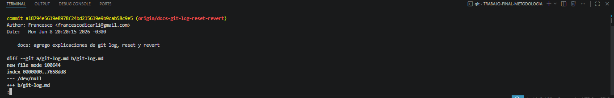
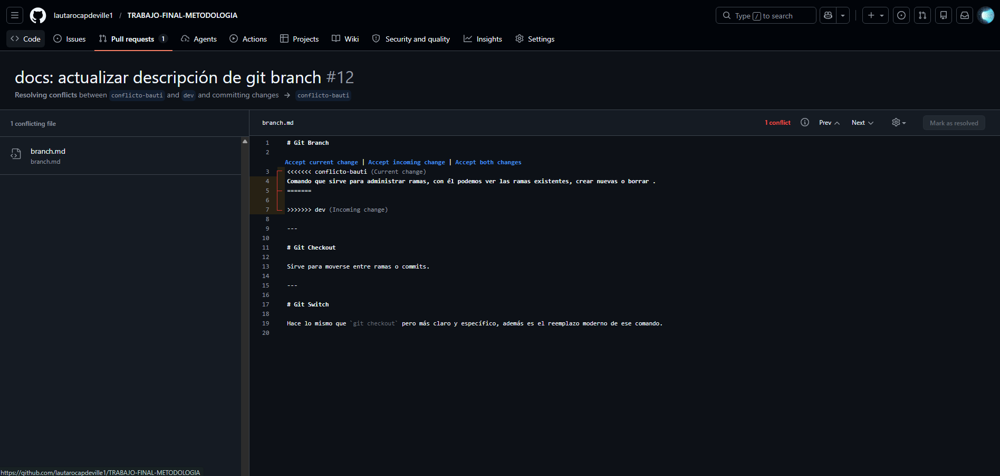

##  mayor cantidad de commits de un integrante
 utilize git shortlog -sn
El usuario con mas commits fue __Bautista cutini__ con 9 commits hechos.
 ## cantidad total de merges  utilize el comando __git log --merges --oneline__
 3 merges en total
 ##  Para ver los conflictos totales utilize 
 __git log --oneline --grep="conflict"__
 hubo un solo conflicto
## cantidad total de ramas  
utilize el comando __git branch__
11 ramas en total

## commit con mayor cantidad de archivos modificados
__a18794e__ para esto, utilize el comando __git log --stat --oneline__
se modificaron 3 archivos, con 18 inserciones en total.

